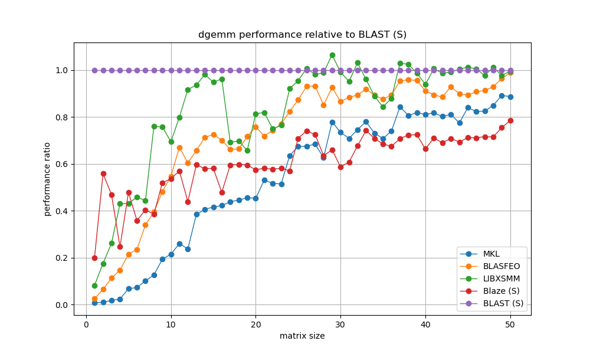

# BLAST
*BLAST* (**BLAS** **T**emplates) is a high-performance linear algebra library that combines a BLAS-like interface with modern C++ template metaprogramming.
*BLAST* implementation is single-threaded and intended for matrices of small and medium size (a few hundred rows/columns), which is common for embedded control applications.

The figures below shows the performance of BLAS *dgemm* routine for different LA implementations on an
*Intel(R) Core(TM) i7-9850H CPU @ 2.60GHz*:



## C++ standard and compilers
*BLAST* uses C++20 standrd, so you need to use a compiler that supports it.

The code performance highly depends on the compiler. We recommend [Clang](https://clang.llvm.org/).

## Installing dependencies
- *CMake 3.24 or higher*.
- *Boost libraries* `sudo apt install libboost-exception-dev`.
- *Blaze 3.9 or higher* https://bitbucket.org/blaze-lib/blaze.
- *BLASFEO* https://github.com/giaf/blasfeo (optional, only if `BLAST_WITH_BLASFEO` is selected). Select a proper target architecture by setting the `TARGET` variable in `Makefile.rule` or in `CMake`. Build and install as usual. The build system searches for BLASFEO in `/opt/blasfeo` by default.
- *Google Test* https://github.com/google/googletest must be installed and findable by the CMake build system (optional, only if `BLAST_WITH_TEST` is selected).

If you want to run benchmarks, you will also need:
- *Google Benchmark* https://github.com/google/benchmark must be installed and findable by the CMake build system (optional, only if `BLAST_WITH_BENCHMARK` is selected).
- *Eigen3 3.3.7 or higher* (optional, if you want to benchmark it).
- For each installed BLAS library such as *MKL*, *OpenBLAS*, etc. a separate benchmark executable will be built, if it is found by *CMake* `FindBLAS`.
- Python3 `sudo apt install python3`
- Matplotlib `sudo apt install python3-matplotlib`


## Building
*BLAST* is a header-only library, so you don't need to build it. You can however build the tests:

1. Install the dependencies.
2. Assuming that you are in the `blast` source root, do

    ```bash
    mkdir build && cd build
    ```
3. Run CMake
```bash
cmake -DBLAST_WITH_TEST=ON ..
```
4. Build
```bash
make -j 10
```
5. Run tests
```bash
ctest
```

## Using
TODO: add examples

## Benchmarks
Either use

`cmake -C cmake/InitialCache.cmake ..`

that has all the right variables set up or specify `BLAST_WITH_BENCHMARK=ON` in *CMake* configure steps if you want to build benchmarks. The following *CMake* variables must be switched ON to enable specific benchmarks:
- `BLAST_BUILD_BLAST_BENCHMARK`
- `BLAST_BUILD_LIBXSMM_BENCHMARK`
- `BLAST_BUILD_BLAS_BENCHMARK`
- `BLAST_BUILD_BLAZE_BENCHMARK`
- `BLAST_BUILD_EIGEN_BENCHMARK`
- `BLAS_BUILD_BLASFEO_BENCHMARK`

For the `BLASFEO` benchmark, you also need to set `BLAST_WITH_BLASFEO=ON`.

Benchmarks will be built in `build/bin/bench-*`. The set of benchmarks depends on the options and the installed libraries. It might look like the following:

```
$ls -1 build/bin/bench*
build/bin/bench-blas-Intel10_64_dyn
build/bin/bench-blas-Intel10_64lp_seq
build/bin/bench-blas-OpenBLAS
build/bin/bench-blasfeo
build/bin/bench-blast
build/bin/bench-blaze
build/bin/bench-blazefeo
build/bin/bench-eigen
build/bin/bench-libxsmm
```
Here `bench-blast` is the benchmark for *BLAST* itself, and the others are for other libraries. You can run all *BLAST* benchmarks by simply typing
```bash
build/bin/bench-blast
```
You can select benchmarks for specific functions using `--benchmark_filter=<regex>`.

There are a few targets in the root `Makefile` that run benchmarks and record results in JSON files. The following command runs and records `dgemm` benchmarks:
```bash
make dgemm-benchmarks
```

There are also a few `make` targets for performance plots:
```bash
make bench_result/image/dgemm_performance.png bench_result/image/dgemm_performance_ratio.png
```

You are welcome to contribute by organizing the existing benchmark, writing more benchmarks, and writing scripts to visualize the results.

### Making benchmarks give more consistent results

So far, we haven't been able to make the benchmarks give always the same results on the same processor. However, what we tried so far is :

- isolating CPU 11 by adding 'nohz_full=5,11 isolcpus=domain,managed_irq,5,11 irqaffinity=0-4,6-10' to the boot parameters (see https://manuel.bernhardt.io/posts/2023-11-16-core-pinning/)
- using taskset -c 11 to then run the benchmark only on that core
- use performance governor (see https://google.github.io/benchmark/reducing_variance.html)
- turn off Intel Boost (see https://llvm.org/docs/Benchmarking.html)
- use benchmark repetitions, random interleaving, warmup time (these are options of Google benchmark)
- fixing the CPU frequency by setting `sudo cpupower frequency-set -g userspace`

## Docker image
To automate building and running benchmarks, a [Dockerfile](Dockerfile) is provided. Use the following commands to build a Docker image and run benchmarks in a Docker container:
```bash
cd blast
docker build . --tag blast_bench .
docker run -v `pwd`/bench_result/docker:/root/blast/bench_result blast_bench
```
The benchmark results will be put in `/bench_result/docker`.
